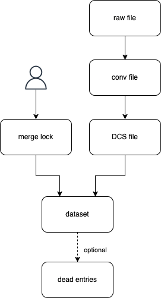

# Data lifecycle

+ Crawlers are downloading raw data and write them to a file
+ If an anime ID leads to a "not found" error, it is added to the dead entries list
+ The raw data is converted to the internal intermediate format and written to a temporary file 
+ Either a new DCS file is created based on the conv file or an existing DCS file is updated with the most recent data.
+ Both the merge lock file and the DCS files are input for the merging process which creates the dataset files.
+ Raw files and conv files are removed after the retention period (default: 1 week).

## What does the lifecycle look like?

Each crawler is given a list of anime IDs. Downloading the raw data can lead to a "not found" (removed entry or not
publicly available). In this case the anime ID is added to the dead entries list of the respective metadata provider if
supported, the respective DCS file is being removed if one existed before and the source is removed from the merge lock
file if was part of a merge lock. Otherwise, the raw data is downloaded in the current weeks working directory.
The file system watcher picks up any newly written file. The metadata specific converter then extracts the data
and writes it to a temporary JSON file alongside the raw file.
After all crawlers have finished the existing DCS files are updated based on the conv files or new DCS files are
created if none existed for the anime ID of that metadata provider.
Both merge lock files and DCS files are then input for the merging process. The dataset files are always overwritten
with the result of the merging process. So they are basically stateless. The only stateful files are the merge lock file,
the DCS files as well as the dead entries files.
After a retention period (default: 1 week) the raw files and the conv files are being deleted.

The project has been designed to create an update every week. Each week anime IDs are re-downloaded based on the data in
the DCS files of existing entries as well as entries which are new to the dataset.
If the process is run more than once within the same week, delta updates are triggered.
This means that only new entries from metadata providers without a pagination strategy will be downloaded.
